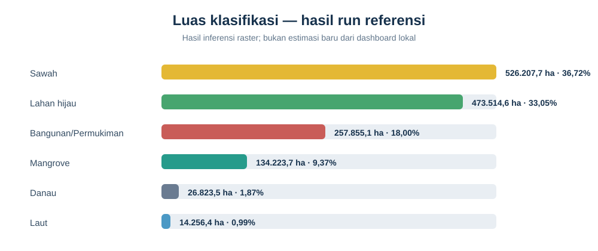

# UTS SIG: Analisis Spasial Penutup Lahan dan Kebijakan di Jawa Timur

**Dari citra Sentinel-2 ke enam kelas tutupan lahan, evaluasi model, dan WebGIS**

> **Asal hasil yang ditampilkan.** Notebook, tabel evaluasi, raster, dan gambar
> hasil yang tersedia berasal dari eksperimen repository
> [PSD-Klasifikasi-Lahan](https://github.com/Rahardian-Ananta/PSD-Klasifikasi-Lahan),
> yang menjadi acuan tugas. Berkas raster Sentinel-2 mentah untuk menjalankan
> ulang seluruh proses tidak tersedia di folder `data` repository tersebut.
> Karena itu, hasil berikut ditandai sebagai **hasil eksperimen referensi**,
> bukan hasil run ulang dari input lokal.

Laporan mengikuti enam bab dengan potongan kode, tabel output, visualisasi, dan
peta seperti alur proyek referensi. Data serta hasil eksperimen yang ditampilkan
dirujuk secara terbuka ke sumbernya.

## Hasil eksperimen singkat

Eksperimen referensi memilih **SVM RBF berbasis fitur per piksel** berdasarkan
CV Macro-F1 (0,521); Macro-F1 test poligonnya 0,474. Raster seluruh wilayah
dibuat dengan Random Forest karena lebih cepat untuk inferensi.

| Kelas | Luas referensi (ha) | Proporsi |
|---|---:|---:|
| Sawah | 526.207,7 | 36,72% |
| Lahan hijau | 473.514,6 | 33,05% |
| Bangunan/Permukiman | 257.855,1 | 18,00% |
| Mangrove | 134.223,7 | 9,37% |
| Danau | 26.823,5 | 1,87% |
| Laut | 14.256,4 | 0,99% |

Lihat juga [gambar peta RGB dan klasifikasi](https://github.com/Rahardian-Ananta/PSD-Klasifikasi-Lahan/blob/main/outputs/figures/rgb_vs_klasifikasi.png)
dan [overlay hasil pada batas Jawa Timur](https://github.com/Rahardian-Ananta/PSD-Klasifikasi-Lahan/blob/main/outputs/figures/klasifikasi_overlay.png)
di repository sumber.

Angka, tabel, dan peta di atas adalah keluaran eksperimen referensi. Jangan
mengutipnya sebagai hasil pengukuran baru tanpa menjalankan ulang notebook
menggunakan raster sumber yang sesuai.

## Enam bab

1. [Business Understanding — tujuan dan pertanyaan analisis](https://rafie110905.github.io/PSD/UTS_Jatim_Bab_01_Business_Understanding.html)
2. [Data Understanding — data, band Sentinel-2A, dan label](https://rafie110905.github.io/PSD/UTS_Jatim_Bab_02_Data_Understanding.html)
3. [Data Preprocessing — penyelarasan, fitur, dan sampel](https://rafie110905.github.io/PSD/UTS_Jatim_Bab_03_Data_Preprocessing.html)
4. [Modeling — perbandingan model klasifikasi](https://rafie110905.github.io/PSD/UTS_Jatim_Bab_04_Modeling.html)
5. [Evaluation — pembagian training/testing dan evaluasi](https://rafie110905.github.io/PSD/UTS_Jatim_Bab_05_Evaluation.html)
6. [WebGIS & Deployment — peta, dashboard, dan kebijakan](https://rafie110905.github.io/PSD/UTS_Jatim_Bab_06_WebGIS_Deployment.html)

## Aplikasi dan data

Aplikasi Streamlit di repository ini menyediakan tujuh halaman dashboard:
**Ringkasan, Alur Data → Model, Peta Klasifikasi, Luas per Kelas, Evaluasi
Model, Data & Unduhan,** dan **Metodologi**. Kode aplikasi ada di
[`app.py`](https://github.com/Rafie110905/PSD/blob/main/PSD/gis_uts/app.py)
dan algoritmanya di
[`classifier.py`](https://github.com/Rafie110905/PSD/blob/main/PSD/gis_uts/classifier.py).
Hasil eksperimen referensi dan gambar dapat dilihat di
[repository sumber](https://github.com/Rahardian-Ananta/PSD-Klasifikasi-Lahan/tree/main/outputs).

Enam kelas keluaran eksperimen referensi adalah **Sawah**,
**Bangunan/Permukiman**, **Mangrove**, **Lahan hijau**, **Laut**, dan **Danau**.
Labelnya berasal dari data sekunder Kementan, BIG, dan Natural Earth; bukan
hasil survei lapangan baru. Peta bukan peta resmi tata ruang.

Dashboard lokal memiliki alur input tersendiri dan masih memerlukan berkas
raster agar bisa menghitung ulang skor. Untuk melihat kode dan hasil run yang
tersimpan, lanjutkan dari Bab 1 sampai Bab 6 dan buka tautan artefak sumber.
