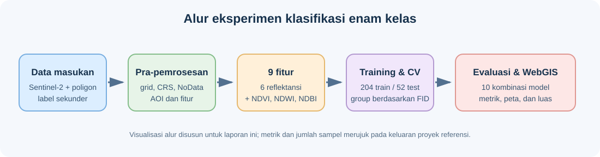

# Bab 2 — Data Understanding



## 2.1 Inventaris dan status data

| Dataset | Fungsi | Data eksperimen referensi |
|---|---|---|
| Sentinel-2 L2A | Fitur spektral | Metadata mencatat 6 band, 10 m, EPSG:32749; raster mentah tidak ada di folder `data` |
| Batas Jawa Timur | AOI | `boundary_jatim.geojson` |
| Sampel label enam kelas | Training/testing | GeoJSON dan GPKG tersedia di `data` |
| Data tematik sekunder | Label kelas | Kementan (sawah), BIG (bangunan, mangrove, lahan hijau, danau), Natural Earth (laut) |

Proyek referensi menyediakan 2.823 poligon sumber. Pemilihan data modeling
menggunakan 256 poligon: 50 per kelas Sawah, Bangunan, Mangrove, Lahan hijau,
dan Danau, serta 6 poligon Laut.

| Kelas | Poligon sumber |
|---|---:|
| Sawah | 500 |
| Bangunan/Permukiman | 500 |
| Mangrove | 500 |
| Lahan hijau | 500 |
| Laut | 500 |
| Danau | 323 |
| **Total** | **2.823** |

Jumlah poligon sumber bukan jumlah training/testing; hanya sampel terpilih
yang masuk ke eksperimen.

## 2.2 Pengumpulan data

Gunakan produk Sentinel-2 Level-2A (*Bottom-of-Atmosphere surface reflectance*)
dengan tanggal komposit yang dicatat. Komposit multi-temporal yang telah
dimask awan dan bayangan awan lebih sesuai daripada satu citra berawan.
Sampel poligon enam kelas pada proyek acuan dikumpulkan dari data sekunder
Kementan, BIG, dan Natural Earth. Catat sumber, tanggal pengambilan, dan CRS.

### Metadata citra dan cuplikan pemeriksaan

Metadata run referensi mencatat koleksi Sentinel-2 L2A, komposit median
1–2 September 2025, enam band, maksimum tutupan awan 20%, grid 10 m, dan
proyeksi EPSG:32749. Profil raster yang tersimpan menunjukkan ukuran
59.412 × 41.323 piksel. Raster citra sumber sendiri tidak disertakan di folder
`data`.

Contoh pemeriksaan metadata/output yang tersimpan:

```python
import json
from pathlib import Path

profile = json.loads(
    Path("outputs/tables/s2_profile.json").read_text(encoding="utf-8")
)
print(profile["bands"], profile["crs"], profile["res"])
print(profile["width"], profile["height"], profile["total_pixel"])
```

```text
['B02', 'B03', 'B04', 'B08', 'B11', 'B12'] EPSG:32749 [10.0, 10.0]
59412 41323 2455082076
```

Berikut contoh kode Earth Engine untuk mengambil komposit yang dapat
direproduksi; ganti asset path AOI sesuai akun yang digunakan.

```javascript
var roi = ee.FeatureCollection(
  'projects/PROJECT_ANDA/assets/jawa_timur'
).geometry();

function maskClouds(image) {
  var scl = image.select('SCL');
  var clear = scl.neq(0).and(scl.neq(1)).and(scl.neq(3))
    .and(scl.neq(8)).and(scl.neq(9)).and(scl.neq(10)).and(scl.neq(11));
  return image.updateMask(clear);
}

var bands = ['B2', 'B3', 'B4', 'B8', 'B11', 'B12'];
var s2 = ee.ImageCollection('COPERNICUS/S2_SR_HARMONIZED')
  .filterBounds(roi)
  .filterDate('2025-09-01', '2025-09-03')
  .filter(ee.Filter.lte('CLOUDY_PIXEL_PERCENTAGE', 70))
  .map(maskClouds)
  .select(bands)
  .median()
  .clip(roi)
  .toInt16();

Export.image.toDrive({
  image: s2, description: 'JawaTimur_Sentinel2_2025',
  region: roi, crs: 'EPSG:32749', scale: 10, maxPixels: 1e13
});
```

## 2.3 Band Sentinel-2A

Instrumen MSI Sentinel-2 mengukur 13 band pada resolusi asli 10 m, 20 m, atau
60 m. Eksperimen referensi memakai B02, B03, B04, B08, B11, dan B12. Dashboard
Streamlit terpisah di repository UTS menerima sepuluh band. Resampling band
20 m menyamakan grid, tetapi tidak menambah informasi spasial.

| Band | Nama | Panjang gelombang tengah (µm) | Resolusi | Kegunaan umum |
|---|---|---:|---:|---|
| B1 | Coastal aerosol | 0.443 | 60 m | Aerosol pesisir/koreksi atmosfer |
| B2 | Blue | 0.490 | 10 m | Warna tampak dan air dangkal |
| B3 | Green | 0.560 | 10 m | Warna vegetasi dan respons air |
| B4 | Red | 0.665 | 10 m | Serapan klorofil dan batas vegetasi |
| B5 | Red Edge 1 | 0.705 | 20 m | Kondisi vegetasi |
| B6 | Red Edge 2 | 0.740 | 20 m | Gradien red-edge |
| B7 | Red Edge 3 | 0.783 | 20 m | Vegetasi dan biomassa |
| B8 | Near Infrared | 0.842 | 10 m | Vegetasi sehat dan pemisahan air |
| B8A | Narrow NIR | 0.865 | 20 m | Respons NIR sempit |
| B9 | Water vapour | 0.945 | 60 m | Uap air atmosfer |
| B10 | Cirrus | 1.375 | 60 m | Deteksi cirrus |
| B11 | SWIR 1 | 1.610 | 20 m | Kelembapan dan lahan terbangun |
| B12 | SWIR 2 | 2.190 | 20 m | Kelembapan, tanah, kebakaran |

## 2.4 Kualitas dan keterbatasan referensi

Label berasal dari beberapa sumber sekunder dengan skema berbeda, sehingga
definisi kelas perlu dibaca bersama atribut sumbernya. Piksel campuran,
awan/bayangan, beda waktu citra dan sumber poligon, serta ketidakseimbangan
jumlah poligon dapat memengaruhi evaluasi.

### Profil spektral hasil run referensi

Lihat [profil spektral per kelas](https://github.com/Rahardian-Ananta/PSD-Klasifikasi-Lahan/blob/main/outputs/figures/profil_spektral.png)
dan [batas Jawa Timur](https://github.com/Rahardian-Ananta/PSD-Klasifikasi-Lahan/blob/main/outputs/figures/boundary_jatim.png)
di repository sumber.

Gambar dan jumlah poligon pada bab ini bersumber dari keluaran eksperimen
referensi, bukan dari eksperimen input dashboard UTS ini.
