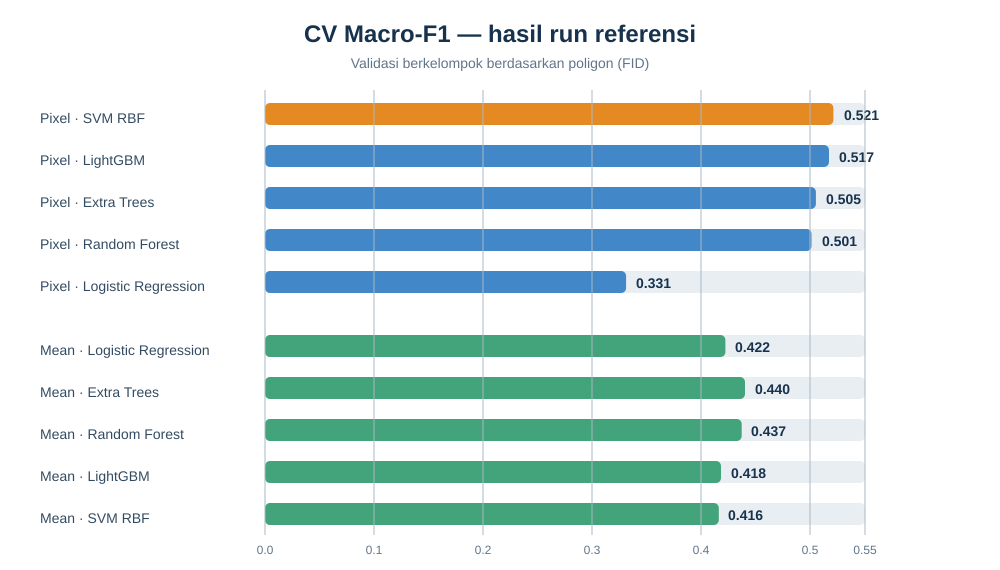

# Bab 5 — Evaluation

## 5.1 Jumlah kelas dan data

Ada **6 kelas**. Eksperimen referensi memilih 256 poligon dan membaginya
menjadi 204 training dan 52 testing. Angka adalah jumlah poligon, bukan piksel.

| Kelas | Total | Training | Testing |
|---|---:|---:|---:|
| Sawah | 50 | 40 | 10 |
| Bangunan/Permukiman | 50 | 40 | 10 |
| Mangrove | 50 | 40 | 10 |
| Lahan hijau | 50 | 40 | 10 |
| Laut | 6 | 4 | 2 |
| Danau | 50 | 40 | 10 |
| **Total** | **256** | **204** | **52** |

Distribusi test merujuk pada split eksperimen referensi. Dashboard UTS sendiri
baru menampilkan jumlah aktual setelah input eksperimen diunggah.

## 5.2 Metrik yang dilaporkan

- **Accuracy**: proporsi seluruh prediksi benar.
- **Balanced accuracy**: rerata recall tiap kelas, agar kelas kecil tetap
  diperhitungkan.
- **Macro-F1**: rerata F1 antar kelas tanpa bobot jumlah piksel; menjadi
  kriteria pemilihan model.
- **Cohen's κ**: kesepakatan prediksi dengan label setelah mengoreksi peluang
  kesepakatan acak.
- **Confusion matrix** dan precision/recall/F1 tiap kelas: menunjukkan jenis
  kelas yang tertukar.

### Hasil run referensi: Macro-F1

| Representasi | Model | CV Macro-F1 | Test Macro-F1 (poligon) | Test accuracy (poligon) |
|---|---|---:|---:|---:|
| Pixel | SVM RBF | **0,521** | **0,474** | 0,538 |
| Pixel | LightGBM | 0,517 | 0,450 | 0,519 |
| Pixel | Extra Trees | 0,505 | 0,447 | 0,519 |
| Pixel | Random Forest | 0,501 | 0,465 | 0,538 |
| Pixel | Logistic Regression | 0,331 | 0,391 | 0,500 |
| Mean poligon | Logistic Regression | 0,422 | 0,466 | 0,596 |
| Mean poligon | Extra Trees | 0,440 | 0,404 | 0,481 |
| Mean poligon | Random Forest | 0,437 | 0,444 | 0,519 |
| Mean poligon | LightGBM | 0,418 | 0,450 | 0,538 |
| Mean poligon | SVM RBF | 0,416 | 0,444 | 0,558 |

SVM pixel memiliki CV Macro-F1 tertinggi (0,521). README referensi menyebut
Random Forest pixel dipakai untuk raster akhir karena inferensinya lebih cepat;
model terbaik untuk evaluasi dan model pembuat peta bukan selalu sama.
Sumber tabel:
[`test_vs_cv.csv`](https://github.com/Rahardian-Ananta/PSD-Klasifikasi-Lahan/blob/main/outputs/tables/test_vs_cv.csv).

## 5.3 Validitas dan ketidakpastian

Holdout berdasarkan FID dan CV dengan group poligon mencegah satu poligon
masuk ke kedua subset/fold. Metrik tetap mengukur kesesuaian dengan sampel
sekunder, bukan akurasi lapangan independen. Untuk klaim tematik, kumpulkan
sampel validasi lapangan atau interpretasi visual independen dengan rancangan
sampling terdokumentasi.

Sumber ketidakpastian utama adalah beda definisi kelas antar sumber,
ketidaklengkapan/ketelitian poligon, piksel campuran, awan/bayangan, serta
ketidakcocokan waktu antara citra dan poligon. Cantumkan tanggal, resolusi,
CRS, seed, dan jumlah sampel ketika melaporkan hasil final.

Lihat [confusion matrix test](https://github.com/Rahardian-Ananta/PSD-Klasifikasi-Lahan/blob/main/outputs/figures/test_confusion_winner.png)
dan [sebaran skor CV](https://github.com/Rahardian-Ananta/PSD-Klasifikasi-Lahan/blob/main/outputs/figures/cv_spread_time.png)
di repository sumber.
